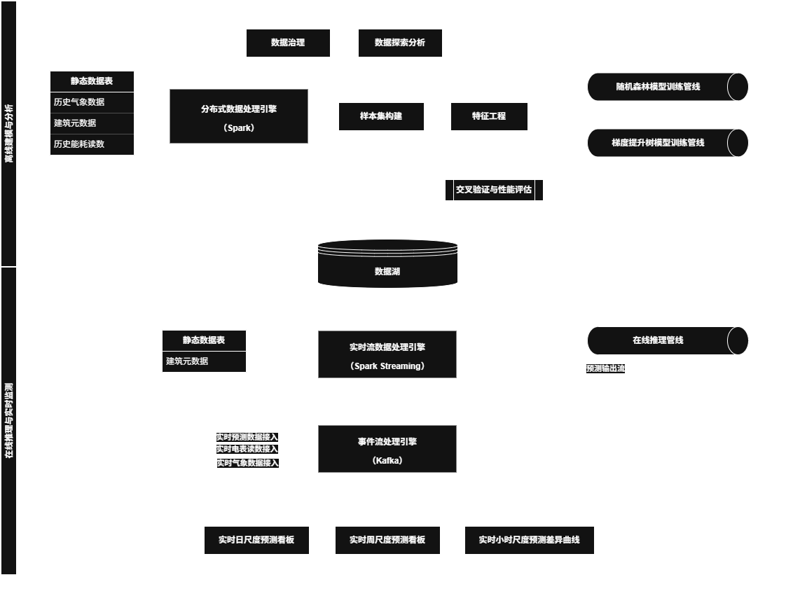

[English](README.md)|[中文简体](README.ch-zh.md)

# **实时建筑能耗负荷预测平台**

## **1 项目介绍**
本项目构建了一个基于 Spark 与 Kafka 的大数据建筑能耗预测与实时监测系统原型，以实现建筑能耗的趋势预测与异常检测。系统整体采用分层存储加批流一体化架构设计，涵盖数据采集、分布式处理、模型训练、实时推理与可视化展示的完整流程，可模拟小时级能耗数据的实时流入与预测过程。本人独立完成系统架构设计、流式处理实现及模型优化部分。

---

## **2 数据介绍**
数据由莫纳什大学（Monash University）提供，涵盖 2022 年全年、时间精度至小时级，覆盖澳大利亚墨尔本多个区域的多栋建筑，包括：
1. 气象数据（空气气温、地表气温、风速、风向、云层遮盖率等）
2. 建筑元数据（楼层数、功能用途、占地面积等）
3. 电表读数

---

## **3 项目结构图**

---

## **4 项目流程介绍**
系统采用批流一体设计，离线层负责历史数据治理与模型训练，在线层承接实时流接入与在线推理；两层通过模型持久化与数据湖解耦联动。

### **4.1 数据存储与接入**
系统的数据域采用“三层主题”组织方式：建筑元数据层、气象数据层与能耗负荷数据层相互独立又可关联。每一层同时设有静态历史区与实时/接入区：静态区以 CSV/Parquet 混合格式存储，由 Spark 进行批量读取，用于特征工程与离线训练；实时区以 Parquet 合适存储，通过 Kafka 流式引入，使下游流处理与在线推理能够以较低时延消费数据。整体粒度以小时级为主，便于按天聚合与跨域关联，同时兼顾离线吞吐与在线时效。

### **4.2 离线建模与分析层**
离线建模与分析以 Spark 为核心完成数据清洗、特征构造与样本集生成。在对随机森林与梯度提升树等集成学习算法进行基准精度对比后，最终选定梯度提升树作为主模型；基准 RMSLE 为 2.03，经过包含学习率、树深度与迭代轮数在内的超参数调优后，将误差降至 1.33。训练完成的最优模型进行持久化，供在线推理模块按需加载，形成从离线到在线的可迁移闭环。

### **4.3 在线推理与实时监测层**
在线推理与监测部分以 Kafka 承载实时能耗与气象数据流，Spark Streaming 负责窗口聚合与在线预测。我设定 5 秒水位线阈值以处理乱序和延迟，并采用 7 秒窗宽的非重叠窗口计算（基于实验平衡吞吐与延迟的结果），既保证吞吐稳定，又控制端到端延迟。为增强运行韧性，流作业启用了检查点（checkpoint）以支持断点恢复与状态一致性，确保在故障或重启后能够平滑续跑。

### **4.4 流量模拟**
在此基础上，为验证系统在高频流场景下的稳定性，我设计了可控的流量模拟方案：源数据以小时为精度，每 24 条代表 24 小时并共享同一秒级时间戳；系统以每 5 秒发送 120 条的速率推送至 Kafka，以此驱动高频在线预测与窗口聚合。预测结果与关键监测指标实时回填到可视化仪表板，用于能耗趋势观察与异常告警展示，从而完整呈现批流一体架构下的端到端数据通路与工程实现能力。

---

**技术栈：** Spark · Kafka · Python · 集成学习（随机森林 · 梯度提升树）