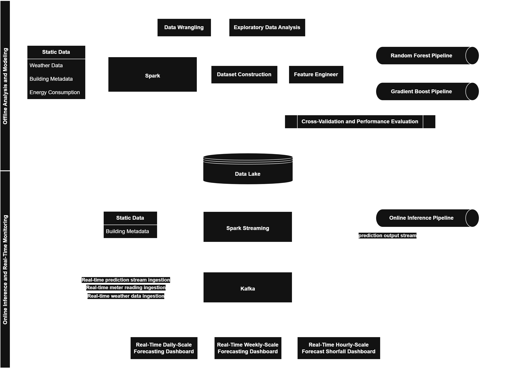

[English](README.md) | [简体中文](README.ch-zh.md) 

# **Real-Time Building Energy Load Forecasting Platform**

## **1. Project Introduction**

This project builds a prototype big data system for building energy consumption forecasting and real-time monitoring, based on Spark and Kafka, to achieve energy trend prediction. The overall system adopts a layered storage and batch–stream integrated architecture design, covering the complete process of data collection, distributed processing, model training, real-time inference, and visualization. It can simulate the real-time streaming and prediction of hourly energy consumption data. I independently completed offline modeling and analysis, as well as the implementation of online inference and real-time monitoring.

## **2. Data Description**

The dataset is provided by Monash University, covering the entire year of 2022 with hourly granularity and multiple buildings in different regions of Melbourne, Australia. It includes:  
1. Meteorological data (air temperature, surface temperature, wind speed, wind direction, cloud cover rate, etc.)  
2. Building metadata (number of floors, functional use, floor area, etc.)  
3. Electric meter readings

For more details, please refer to the [Simulated Data Lake](DataStorage/README.md) section.

## **3. Project Workflow Diagram**

## **4. Project Workflow Description**

The project adopts a batch–stream integration design: the offline layer is responsible for historical data governance and model training, while the online layer handles real-time data ingestion and online inference. The two layers are decoupled and connected through a data lake.

### **4.1. Data Storage and Ingestion**

The system’s data domain is organized into four thematic layers: Building Metadata Layer, Meteorological Data Layer, Energy Load Layer, and Model Layer. The first three layers each have both a static (historical) zone and a real-time/ingestion zone: The static zone stores data in a CSV/Parquet hybrid format, read in batches by Spark for feature engineering and offline training. The real-time zone stores data in Parquet format, streamed in via Kafka, allowing downstream stream processing and online inference to consume data with low latency.  
Overall data granularity is primarily hourly.

### **4.2. Offline Modeling and Analysis**

Offline modeling and analysis are completed using Spark for data cleaning, feature construction, and sample generation. After comparing benchmark accuracy between ensemble learning algorithms such as Random Forest and Gradient Boosted Trees, the latter was selected as the primary model. The baseline RMSLE of the Gradient Boosted Tree model was 2.03, and after hyperparameter tuning—including learning rate, tree depth, and iteration count—the error was reduced to 1.33.  
The trained optimal model is stored in Parquet format in the data lake and is loaded by the online inference module as needed.

### **4.3. Online Inference and Real-Time Monitoring**

The online inference and monitoring component uses Kafka to carry real-time streams of predictions, energy, and meteorological data, while Spark Streaming performs window aggregation and online prediction. A 5-second watermark threshold is set to handle out-of-order and delayed data, and a 7-second non-overlapping window is used (based on experimental results balancing throughput and latency), ensuring both stable throughput and controlled end-to-end latency.  
To enhance system resilience, checkpointing is enabled to support fault recovery and state consistency, ensuring smooth resumption after failure or restart.

### **4.4. Stream Simulation**

The source data has hourly precision, with each 24 records representing 24 hours and sharing the same second-level timestamp. The system pushes 120 records every 5 seconds to Kafka, driving high-frequency online prediction and window aggregation. Prediction results and key monitoring metrics are written back in real time to a visualization dashboard, supporting observation of energy consumption trends and anomaly alerts, thereby fully demonstrating the end-to-end data pipeline and engineering capability under the batch–stream integrated architecture.

## **5. Project Workflow Description**

For detailed implementation, please refer to the [Project Code](Scripts/README.md) section.

---

**Tech Stack:** Spark · Kafka · Python · Ensemble Learning (Random Forest · Gradient Boosted Trees)
